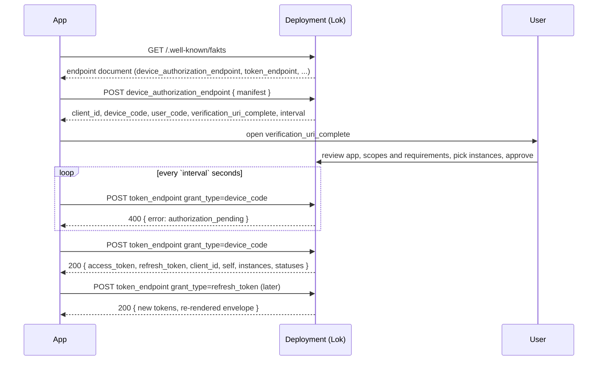

An Arkitekt deployment is not one program. It is a set of independent services
that can live on one machine, be spread over several, or sit next to a compute
cluster. A few typical setups:

- **Single machine.** Every service runs on one host. This is the default and the
  easiest way to get started.
- **Multiple machines.** Several storage servers, each with its own backend, each
  running its own storage service.
- **Cluster.** A service with access to a computational cluster runs on a separate
  machine and is connected to the rest of the platform.

With this flexibility comes a question: how does an app that wants to connect
learn *where* the services are, and how does it prove *who* it is before it is
told? Arkitekt answers both with one protocol: **Fakts**.

## Fakts in one paragraph

Fakts is a thin layer on top of standard **OAuth2**. An app discovers a deployment
through a well-known URL, registers itself as an OAuth2 client by presenting its
[Manifest](/docs/design/terminology/manifest), and is then authorized with the
**device authorization grant**
([RFC 8628](https://datatracker.ietf.org/doc/html/rfc8628)), the same flow you
know from logging a TV or a CLI tool into an online account. The only
Arkitekt-specific part is that a successful token response carries an extra
**envelope** next to the access token: the rendered configuration of every
service the app asked for. The tokens are ordinary OAuth2 tokens issued by
[Lok](/docs/design/services/lok), and are refreshed through the ordinary OAuth2
token endpoint.

If you have implemented an OAuth2 device flow before, you already know almost all
of Fakts. If you have not, the rest of this page walks through the four steps.

<Callout type="info" title="Protocol version 2">
This page describes the current Fakts protocol, as implemented by the Orkestrator
client. The previous protocol (a custom `start`, `challenge` and `claim` sequence
with its own `auth` block) is retired. A deployment that still speaks it answers
discovery but fails the endpoint check in step 0, so clients can tell "wrong
protocol version" apart from "server unreachable". See
[What's changed from Paper to Next](#whats-changed-from-paper-to-next) at the
end.
</Callout>

## The flow



### Step 0: Discover the deployment

The app knows a single thing: a host name or URL, for example
`arkitekt.example.org` or `http://localhost:8000`. It fetches the well-known
document at that base:

```http
GET https://arkitekt.example.org/.well-known/fakts
```

If the user typed a bare host without a scheme, clients try `https://` first and
`http://` as a fallback. The response describes the deployment and, most
importantly, tells the app which OAuth2 endpoints to use:

```json
{
  "name": "My Lab Deployment",
  "version": "1.0.0",
  "protocol_version": "2",
  "description": "Arkitekt for the imaging facility",
  "base_url": "https://arkitekt.example.org",

  "configure": "https://arkitekt.example.org/lok/configure?code={code}",
  "device_authorization_endpoint": "https://arkitekt.example.org/lok/o/device/",
  "token_endpoint": "https://arkitekt.example.org/lok/o/token/",

  "issuer": "https://arkitekt.example.org/lok",
  "jwks_uri": "https://arkitekt.example.org/lok/.well-known/jwks.json",
  "grant_types_supported": [
    "urn:ietf:params:oauth:grant-type:device_code",
    "refresh_token"
  ],
  "token_endpoint_auth_methods_supported": ["none"]
}
```

The three fields the flow runs on are `configure`,
`device_authorization_endpoint` and `token_endpoint`. They are required. The
rest (`issuer`, `jwks_uri`, supported grant types) is the usual OAuth2 server
metadata, and is what lets every other service verify the JWTs Lok issues on its
own, without calling back to Lok.

Apps cache this document together with their session so they can reconnect
without rediscovering.

### Step 1: Register and request device authorization

The app posts its manifest to the device authorization endpoint. This one call
does two things at once: it **dynamically registers** the app as a public OAuth2
client (minting a `client_id` from the manifest) and it starts a **device
authorization** request.

```http
POST https://arkitekt.example.org/lok/o/device/
Content-Type: application/json

{
  "manifest": {
    "identifier": "live.arkitekt.orkestrator",
    "version": "0.0.1",
    "scopes": ["openid"],
    "logo": "https://example.org/logo.png",
    "requirements": [
      { "key": "lok",     "service": "live.arkitekt.lok" },
      { "key": "rekuest", "service": "live.arkitekt.rekuest", "optional": false },
      { "key": "mikro",   "service": "live.arkitekt.mikro",   "optional": false },
      { "key": "kabinet", "service": "live.arkitekt.kabinet", "optional": true }
    ]
  },
  "requested_client_kind": "desktop",
  "expiration_time_seconds": 300
}
```

The **manifest** is what the user will be shown, and what the deployment uses to
decide which configuration to render. Its `requirements` list the services the
app needs: each has a `key` the app will use to look the service up later, the
`service` identifier it must be an instance of, and whether it is `optional`.
The optional fields `requested_client_kind` (a label such as `desktop`, `website`
or `development`) and `expiration_time_seconds` (how long the user has to
approve) do not change the grant itself.

The response is a standard RFC 8628 device authorization response, plus the
freshly minted `client_id` and the token endpoint to poll:

```json
{
  "status": "granted",
  "client_id": "b1f0c1e2-...",
  "device_code": "3f9c2b9a1d8e4f7a9c0b2e1d5a6f7b8c...",
  "user_code": "ABCD-1234",
  "verification_uri": "https://arkitekt.example.org/lok/configure",
  "verification_uri_complete": "https://arkitekt.example.org/lok/configure?code=ABCD-1234",
  "token_endpoint": "https://arkitekt.example.org/lok/o/token/",
  "expires_in": 300,
  "interval": 5
}
```

Two codes come back and they play different roles:

- `device_code` is a long, full-entropy secret. The app keeps it and uses it to
  poll. It is never shown to a human.
- `user_code` is short and transcribable. It is what the configure page carries,
  and what a user would type if they had to enter it by hand.

The `client_id` exists from this moment, but it is unusable until a human
approves the code.

### Step 2: The user approves the app

The app opens `verification_uri_complete` for the user, in a browser window, a
pop-out, or by printing the link in a terminal. The URL is built by the server
from its own `configure` template, so a deployment can move the page without any
client knowing.

On that page the user sees the app's identity, version and logo, the scopes it
asks for, and the requirements it declares. For each requirement the user picks
which running **instance** of that service the app should be given (a deployment
may have more than one instance of a service, for example two storage backends),
or denies it. Optional requirements can be left unsatisfied. Then they approve.

This is the "log in with Google" moment of Arkitekt. It authenticates the user
*and* authorizes the app in one step, which is why Arkitekt talks about a
[double authentication](/docs/design/security/identity#two-step-authentication-users-and-apps).

### Step 3: Poll the token endpoint

While the user is busy, the app polls the token endpoint with the device-code
grant, exactly as RFC 8628 prescribes. The request is form-encoded, and because
the app is a public client it sends only its `client_id`, no secret:

```http
POST https://arkitekt.example.org/lok/o/token/
Content-Type: application/x-www-form-urlencoded

grant_type=urn:ietf:params:oauth:grant-type:device_code
&device_code=3f9c2b9a1d8e4f7a9c0b2e1d5a6f7b8c...
&client_id=b1f0c1e2-...
```

Until the user has decided, the answer is an HTTP 400 with a standard OAuth2
error member. Clients branch on `error`, never on the HTTP status alone:

| `error`                 | Meaning                                              | What the client does                       |
| ----------------------- | ---------------------------------------------------- | ------------------------------------------ |
| `authorization_pending` | The user has not approved yet.                       | Wait `interval` seconds, poll again.       |
| `slow_down`             | Polled too fast.                                     | Add 5 seconds to the interval, keep going. |
| `access_denied`         | The user declined.                                   | Stop, tell the user.                       |
| `expired_token`         | `expires_in` passed without a decision.              | Stop, start over from step 1.              |

The loop is bounded by the wall clock (`expires_in`), not by a retry count.

Once the user approves, the same request returns HTTP 200 with a **standard
OAuth2 token response**, and the Fakts **envelope** appended to it:

```json
{
  "access_token": "eyJhbGciOiJSUzI1NiIs...",
  "token_type": "Bearer",
  "expires_in": 3600,
  "scope": "openid",
  "refresh_token": "def50200...",
  "client_id": "b1f0c1e2-...",

  "self": {
    "deployment_name": "My Lab Deployment",
    "alias": {
      "id": "lok-public",
      "host": "arkitekt.example.org",
      "port": 443,
      "ssl": true,
      "path": "lok",
      "challenge": "ht",
      "public": true
    }
  },
  "instances": {
    "lok": {
      "identifier": "lok",
      "service": "live.arkitekt.lok",
      "aliases": [
        { "id": "lok-public", "host": "arkitekt.example.org", "port": 443, "ssl": true, "path": "lok", "challenge": "ht", "public": true }
      ]
    },
    "mikro": {
      "identifier": "mikro-facility",
      "service": "live.arkitekt.mikro",
      "aliases": [
        { "id": "mikro-lan", "host": "10.0.0.12", "port": 8080, "ssl": false, "path": "", "challenge": "ht" },
        { "id": "mikro-public", "host": "arkitekt.example.org", "port": 443, "ssl": true, "path": "mikro", "challenge": "ht", "public": true }
      ],
      "challenge_key": { "kind": "ed25519", "key": "MCowBQYDK2VwAyEA..." }
    },
    "rekuest": { "...": "..." }
  },
  "statuses": {
    "lok": "granted",
    "rekuest": "granted",
    "mikro": "granted",
    "kabinet": "unavailable"
  }
}
```

The device code is **single-use**: this response burns it server-side. From here
on the app never polls again. Continuity is the refresh chain described in step 4.

There is no separate "claim" or "give me my config" request any more: the token
and the configuration arrive together, in one response, and the identity that
used to live in a bespoke `auth` block is now just the standard token-response
members (`access_token`, `refresh_token`, `client_id`).

### Step 4: Refresh, and pick up configuration changes

Access tokens are short-lived. When one is close to expiry, or when a service
rejects it, the app refreshes through the same token endpoint with the standard
refresh grant, again as a public client:

```http
POST https://arkitekt.example.org/lok/o/token/
Content-Type: application/x-www-form-urlencoded

grant_type=refresh_token
&refresh_token=def50200...
&client_id=b1f0c1e2-...
```

Two things are worth knowing about refresh in Arkitekt:

- **Refresh tokens rotate.** Every refresh returns a new refresh token and
  invalidates the old one, so the returned token must always be persisted.
- **The envelope comes back too.** The deployment re-renders `self`, `instances`
  and `statuses` on every refresh, resolving aliases against the requesting host.
  This is how an administrator can move a service, add an alias or change an
  instance and have every connected app pick it up on its next refresh, without
  any user re-approving anything. The envelope is appended on a best-effort
  basis. If it is missing, the token is still valid and the app keeps the
  configuration it already has.

Clients coalesce concurrent refreshes into one round-trip, with one exception: a
refresh that was *forced* because a service rejected the current token must
never be satisfied by a refresh that started earlier and may hand back that same
rejected token.

## The envelope

The Fakts envelope is the part of the protocol that is specific to Arkitekt. It
has three members.

**`self`** describes the deployment the app is now part of: its display name and
the alias of the coordinating Lok service.

**`instances`** is a map from the **requirement keys of the manifest** to the
instance the user picked for each. An instance has:

- `identifier`, the name of that particular running instance in the deployment.
- `service`, the service identifier it implements, which matches the
  requirement's `service`.
- `aliases`, one or more ways to reach it (see below).
- `challenge_key`, optionally, an Ed25519 public key an app can use to verify
  that the endpoint it reached is the one the deployment meant.

**`statuses`** records the outcome for every requirement: `granted`, `denied` (the
user said no) or `unavailable` (the deployment has no instance of that service).
A required requirement that is not `granted` means the app cannot function, an
optional one simply switches that feature off.

### Aliases: one service, many addresses

A service is often reachable at more than one address: on the lab network by a
plain IP and port, from the outside through a reverse proxy over TLS, from
another container by its Docker service name. Rather than guessing, each instance
carries an ordered list of **aliases**:

```json
{ "id": "mikro-lan", "host": "10.0.0.12", "port": 8080, "ssl": false, "path": "", "challenge": "ht" }
```

An alias is a full address (`host`, `port`, `ssl`, `path`) plus a `challenge`, a
relative path the app appends to that address to check that the service is
actually reachable from where the app sits. The app walks the list in order,
fetches the challenge URL of each alias with a short timeout, and uses the first
one that answers. Aliases marked `public` are the ones that are expected to work
from anywhere. This is what lets the same configuration serve a desktop app on the
lab network and a browser on the other side of the internet.

## Where the pieces live

- The **server side** of Fakts is part of [Lok](/docs/design/services/lok), the
  coordinator. It serves the well-known document, registers clients, runs the
  configure page, and issues and refreshes tokens.
- The **client side** is small enough to live inside each app. The Orkestrator
  desktop app carries its own implementation, and the
  [fakts](https://github.com/jhnnsrs/fakts) (Python) and
  [fakts-ts](https://github.com/jhnnsrs/fakts-ts) (TypeScript) libraries do the
  same for your own apps. In the Paper version this was split across two
  packages, **Fakts** for configuration and **Herre** for the OAuth2 tokens.
  With the token response now carrying both, one client handles both. Because
  every step is plain HTTP with standard OAuth2 semantics, any OAuth2
  device-flow client can be adapted with a few lines.
- Across networks, the same coordinator role is played by the coordination server
  of the [mesh](/docs/design/security/mesh).

## What's changed from Paper to Next

The Fakts protocol described on this page is the **Next** version. The **Paper**
version (the frozen channel of the original publication) used a custom
sequence that was *inspired by* OAuth2 but not OAuth2. If you are coming from a
Paper deployment or a Paper-era client, this is what moved.

### One protocol instead of two packages

In Paper, connecting an app was two separate concerns handled by two separate
client packages:

- **Fakts** retrieved the configuration. It ran a custom `start`, `challenge`
  and `claim` sequence against the Fakts server and came back with a config that
  included an `auth` block holding a `client_id`, a `client_secret` and a token
  URL.
- **Herre** was an asynchronous OAuth2 client. It took that `auth` block and ran
  a second, ordinary OAuth2 grant (usually client credentials) against Lok to
  obtain the tokens the app actually used, and refreshed them from then on.

In Next these collapse into one flow. The device authorization grant *is* the
app's login, and the token response carries the configuration as its envelope.
There is no `auth` block to hand from one library to the other, no client
secret to store, and no second grant. The Python and TypeScript packages still
carry the `fakts` name, but they now do what Fakts and Herre did together.

### Step by step

| Paper                                                                    | Next                                                                                                              |
| ------------------------------------------------------------------------ | ----------------------------------------------------------------------------------------------------------------- |
| `.well-known/fakts` listed `base_url`, `frontend_url` and a `claim` URL  | `.well-known/fakts` lists `configure`, `device_authorization_endpoint`, `token_endpoint` and OAuth2 server metadata |
| `POST {base_url}start/` with the manifest, returned a single `code`      | `POST device_authorization_endpoint` with the manifest, returns `device_code`, `user_code` and a minted `client_id` |
| User opened `{frontend_url}configure/{code}`                             | User opens `verification_uri_complete`, built by the server from its own template                                  |
| `POST {base_url}challenge/` polled; "still waiting" was HTTP 200 `pending` | `POST token_endpoint` with the device-code grant; "still waiting" is HTTP 400 `authorization_pending`             |
| `POST {base_url}claim/` with the challenge token to fetch the config     | Gone. The configuration is appended to the token response                                                         |
| Config carried an `auth` block: `client_id`, `client_secret`, `token_url`, `client_token` | Gone. `access_token`, `refresh_token` and `client_id` are the standard token-response members          |
| Second grant through Herre (`client_credentials`) to get usable tokens   | Gone. The device-code grant already returns the tokens                                                            |
| Confidential client with a secret                                        | Public client, `client_id` only                                                                                   |
| Refresh handled by Herre against `token_url`                             | Same `token_endpoint`, `grant_type=refresh_token`, refresh token rotates, envelope re-rendered                     |
| Alias health reported with the opaque `client_token` to `report_url`     | Reported to `{base_url}report/` with the Bearer access token                                                      |
| Manifest listed `name`, `version`, `scopes`                              | Manifest also lists `requirements` with `key`, `service` and `optional`, which the user sees and approves per instance |
| Envelope had `instances` and `self`                                      | Envelope adds `statuses` per requirement and an optional `challenge_key` per instance                             |

### Telling the two apart

The best signal that a deployment is still on Paper is the well-known document:
if it lacks `configure`, `device_authorization_endpoint` and `token_endpoint`,
stop there and report a protocol mismatch rather than a connection failure. A
Next client cannot talk to a Paper deployment, and a Paper client cannot talk to
a Next deployment. A stored Paper session (a token without `client_id`, an
endpoint without `token_endpoint`) fails to load under a Next client, which is
intended: the user approves the app once more under the new grant.
