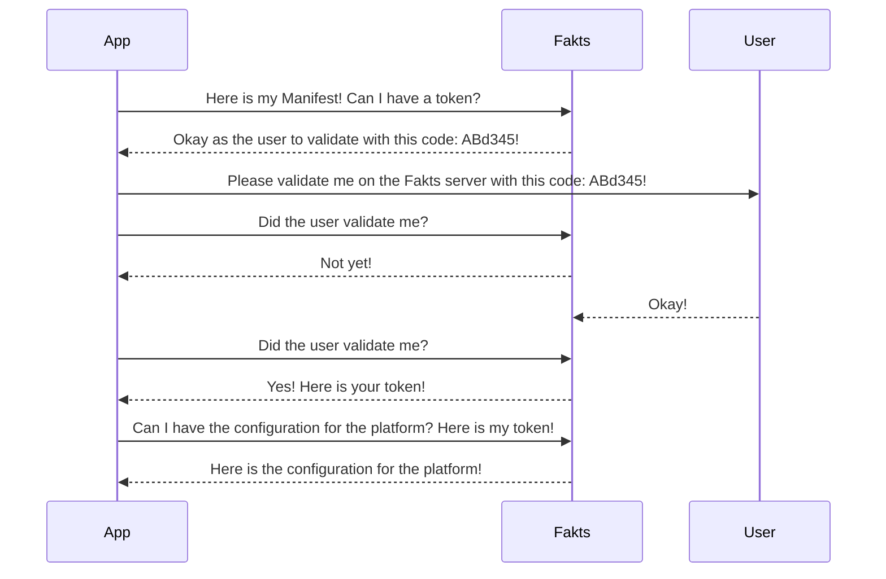

# Async Configuration

The Arkitekt platform, was designed to be a scalable platform, that can be run on a single machine, a cloud environment or on a self-managed cluster of machines, and to enable the platform administrator to easily transition their deployment from on setting to another. To enable this, the platform consists of a number of small services, that can be run on completely different machines, and that share little to no state between them. This pattern allows you to highly
customize your setup.

Example Setups:

## Single Machine

The simplest setup is to run all the services on a single machine. This is the default setup, and is the easiest to get started with

## Multiple Machines

You could imagine a setup where you have multiple storage servers, each with their own storage backend, and you could run the storage service on each

## Cluster

You might want to enable a service that has access to a computational cluster, and that can submit jobs to the cluster, you could easily run and
configure this service on a separate machine, and connect it to the rest of the platform.

# Configuration

With this flexibility however, comes the need to enable a strategy to configure and tell the apps connecting to the platform, where to find the other services. To enable this, we have implemented a simple configuration system, that allows you to configure the platform in a number of different ways: Fakts.

## Fakts

Fakts is a simple protocol, that allows Apps to authenticate themselves with the platform and to retrieve configuration information from a central well known server, that will help them discover all services running in a given deployment. Similar to the Oauth2 protocol, the Fakts protocol is based on the concept of tokens, that are issued by the central server, and that can be used to authenticate the app with the platform, and to retrieve configuration information.

### Example

The following example shows how an app uses the Fakts protocol to authenticate itself with the platform and to retrieve configuration information.
Before the app will connect to any service, it will send out a preflight request to the Fakts server, in order to retrieve a token, this token will then be used to authenticate the app with the platform, and to retrieve configuration information.


```yaml
# Example App Manifest
name: "Example App"
version: "0.1.0"
description: "This is an example app"
author: "John Doe"
requirements:
    - "cuda"

```


When sending out the preflight request, the app will send its [Manifest](#manifest) to the Fakts server, which will then use the information in the manifest to determine the configuration information for the app. Additionally the App can send a list of other parameters like, which type of authenticaiton it would like to use, or which version of the platform it would like to connect to.
Depending on modifiable strategies installed on the Fakts server, the app might be asked to authenticate itself with the platform, before it can retrieve the token. This is done by sending a code to the user, which the user can then use to authenticate the app with the platform. Once the app has been authenticated, it can retrieve the token, and use it to retrieve the configuration information for the platform.



The configuration, then includes information about all the services running in the deployment, and how to connect to them. The app can then use this information to connect to the platform, and run its tasks.


Problems of distribtued systems and