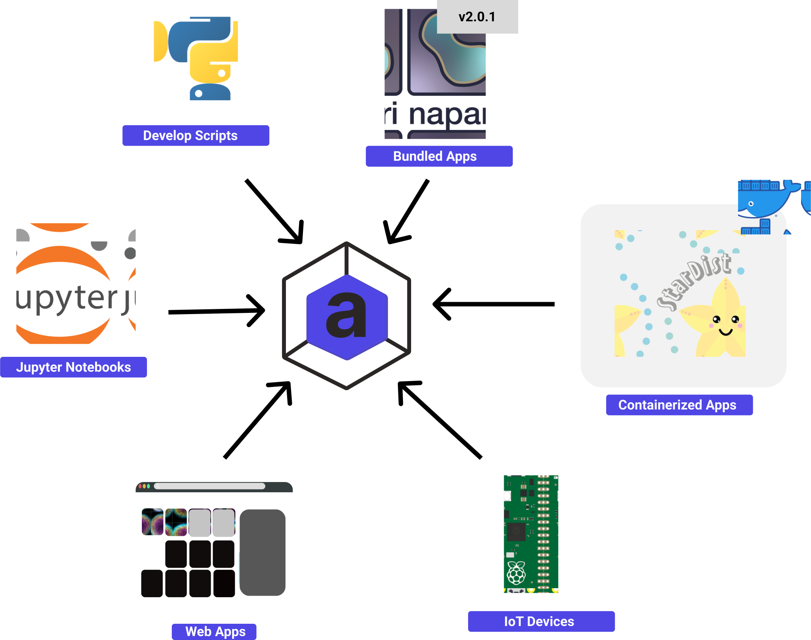

# Everything everywhere, all at once

The world is changing, and so is the way we do science. The amount of data we are generating is increasing exponentially, and the amount of data we can process is increasing at a linear rate. We are generating more data than we can process, and we are generating more data than we can store. Often this leads
to weeks of waiting for the data to be processed, and then weeks of waiting for the results to be analysed.

With Arkitekt we wanted to change this. We wanted to enable users to process their data in real-time, and to be able to analyse the results in real-time, and we wanted the developer to not have to worry about this too much.

## Real-time workflows

Arkitekt is built to enable users to design analysis workflows that can as easily run post-hoc on already generated data, as they can run in real-time on data while it is being generated. Albeit this requires a bit of a different approach to designing and thinking about bioimage workflows, it not only enables users to monitor their data as it is being generated, cutting down on the time it takes to get results, but it also enables users to design closed loop workflows, where the results of the analysis are used to control the experiment.

## Facing bottlenecks

Real-time analysis is a very challenging task, and often unavoidable bottlenecks will arise, rendering your real-time analysis very much week-long. These bottlenecks can be caused by the hardware ( an old computer), the software (a long running deep learning algorithm), or the network (very slow network connection / latency). When using Arkitekt, we wanted to enable the user to be able to identify these bottlenecks, and to be able to fix them as they arise.

Arkitekt therefore provides simple interfaces to debug, monitor and fix these bottlenecks, while the analysis is still running. This enables the user to be able to fix the bottlenecks as they arise, and to be able to continue the analysis in real-time. Even though Arkitekt is a server-client application, that in its default configuration enables the user to run the analysis on multiple computers, you can decide to run/schedule workflows latency on one application, enabling even workflows that are sensitive to sub-millisecond latency.

#### The tools are often very good at what they do, but not very good at doing anything else

Many of the tools available for bioimage analysis are very good at what they do, but they are often not very good at doing anything else. This means that if you want to use a tool for a specific task, you have to use that tool for that task, and you can't use it for anything else. This is a problem because it means that you have to learn a new tool for every task you want to do, and you can't use the tools you already know and love for other tasks.

#### Our tools are stuck in the past or stuck in the future

A lot of the bioimage analysis tools have been written in the last decades and even though they have seen a lot of love and dedication by the developers and the community, the age of the tools is starting to show, which has in turn prompted a new era of bioimage apps, that are designed from the core up to be adapt to the new challenges of bioimage analysis (3D, Big Data, etc.). However, these new tools are often not backwards compatible with the old tools, or are even adapted to completly different ecosystem like the cloud.

#### Meta data is being lost in translation

While traversing a modern bioimage analysis pipeline, the data is often being transformed from one format to another, and the meta data is lost in translation. Often users after the experimentee have to then to go back to the original data to find the meta data they need to make sense of the data

### What we would like to do with Arkitekt for users

Arkitekt was designed to be a platform for non-experts, acknowledging that everyone is a non-expert at some point. Even if you are an expert in one field, you might not an expert in another field of bioimage analysis. We wanted an easy to use platform that would allow users to connect their favourite tools together, and not have to worry about the underlying infrastructure. We wanted you to as easily connect ImageJ to Napari, as you would connect ImageJ to your local Python Script, your Microscope to your Deep Learning Model running in the cloud, and your pipetting robot to your coffee machine (if you have one, or both). 

### What we would like to do with Arkitekt for developers

With Arkitekt we wanted to acknowled that scienctific data analysis is an always evolving, ever-changing beast, and that the solution for today's data won't work tomorrow. Experts in the feild know their problem space very well, and often require very tailored solutions for their specific usecase.They are the best at solving their own problems, and we believe that the best way to enable them to share their expert knowledge is by providing them with tools that don't get in their way.

With Arkitekt we didn't want the developers to have to worry about adhering to a rigid platform or the constraints of doing all their analysis in the cloud,
but to enable them to use the tools they are most comfortable with, and to be able to use the tools they already know and love.

Arkitekt therefore emerged as a platform that acts as a middleman between the user and the developer, enabling the user to seamlessly connect their favourite tools together as well as providing the developer with a simple but powerful interface to enable their tools to be run on the hardware and in the software of their choice.

Arkitekt itself provides only a sound backbone, trying to offload computation to these apps and the hardware they run on. This enables arkitekt to connect multiple apps, written in different programming languages and running on different hardware, to interact and share data.

